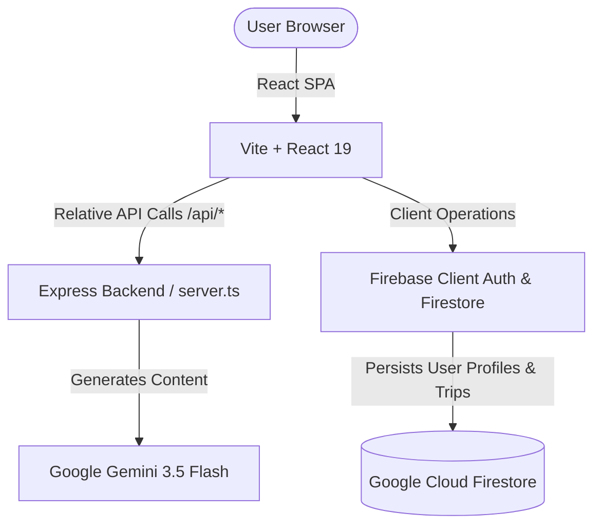

<div align="center">

# 🗺️ Yatrik AI
### *Your Intelligent Travel Companion for Incredible India*

[](https://vite.dev/)
[](https://react.dev/)
[](https://firebase.google.com/)
[](https://deepmind.google/technologies/gemini/)
[](https://vercel.com/)

Yatrik AI is a state-of-the-art travel itinerary generator designed to help travelers plan personalized journeys across India. Leveraging Google's **Gemini 3.5 Flash** with resilient fallbacks, Yatrik AI constructs day-by-day itineraries complete with activities, local culinary recommendations, budget-tailored cost estimates, and key attractions.

[**Explore on GitHub**](https://github.com/Vislavathsunil/Yatrik-AI) • [**Report a Bug**](https://github.com/Vislavathsunil/Yatrik-AI/issues)

</div>

---

## ✨ Features

- 🤖 **AI Travel Assistant**: Chat with Yatrik AI to explore offbeat locations, discover regional cuisines, and plan custom routes.
- 📅 **Dynamic Itinerary Planner**: Instantly generate structured, day-wise itineraries tailored by budget, duration, travelers, and travel style.
- 💼 **Personalized Dashboard**: Save, duplicate, rename, or delete your custom travel itineraries.
- 🔐 **Firebase Secure Auth**: Built-in signup, signin, and password reset workflows with automated Firestore user profile syncing.
- 🖨️ **PDF Generation**: Download complete high-fidelity itineraries to print or save for offline access.
- ⚡ **Resilient Backend**: Backend APIs featuring automated retries and failovers (to `gemini-3.1-flash-lite`) if rate limits or high-demand scenarios occur.

---

## 🛠️ Tech Stack & Architecture



- **Frontend**: React 19, Tailwind CSS, Lucide React, Motion (Framer Motion) for fluid UI/UX.
- **Backend**: Express server running on Node.js.
- **AI Integration**: `@google/genai` client using JSON schema response formatting for parseable, structured payloads.
- **Hosting / Serverless**: Configured for Vercel Serverless Functions + Vercel CDN static hosting.

---

## 🚀 Getting Started

### Prerequisites
- [Node.js](https://nodejs.org/) (v18+)
- A [Google AI Studio API Key](https://aistudio.google.com/)
- A [Firebase Project](https://console.firebase.google.com/) (with Auth & Firestore enabled)

### Local Installation

1. **Clone the Repository:**
   ```bash
   git clone https://github.com/Vislavathsunil/Yatrik-AI.git
   cd Yatrik-AI
   ```

2. **Install Dependencies:**
   ```bash
   npm install
   ```

3. **Configure Environment Variables:**
   Create a `.env` file in the root directory and add the following keys:
   ```env
   # Gemini API Key (Secret, Backend)
   GEMINI_API_KEY=your_gemini_api_key_here

   # Firebase Configurations (Public, Frontend)
   VITE_FIREBASE_API_KEY=your_firebase_api_key
   VITE_FIREBASE_AUTH_DOMAIN=your_firebase_auth_domain
   VITE_FIREBASE_PROJECT_ID=your_firebase_project_id
   VITE_FIREBASE_STORAGE_BUCKET=your_firebase_storage_bucket
   VITE_FIREBASE_MESSAGING_SENDER_ID=your_firebase_messaging_sender_id
   VITE_FIREBASE_APP_ID=your_firebase_app_id
   VITE_FIREBASE_MEASUREMENT_ID=your_firebase_measurement_id
   ```

4. **Run Development Server:**
   ```bash
   npm run dev
   ```
   Open `http://localhost:3000` to view the app.

---

## 📦 Directory Structure

```text
├── api/                  # Vercel Serverless Function entry point
│   └── index.ts          # Serverless app export
├── src/                  # React Frontend Code
│   ├── assets/           # Statics & images
│   ├── components/       # UI Components (Dashboard, etc.)
│   ├── firebase/         # Firebase Client Helpers (auth, firestore)
│   ├── App.tsx           # Main application state and rendering
│   ├── main.tsx          # React application entry point
│   └── types.ts          # TypeScript Typings
├── server.ts             # Express Backend Server (Gemini integration)
├── firestore.rules       # Security rules for Cloud Firestore
├── vercel.json           # Vercel deployment configuration
└── tsconfig.json         # TypeScript configuration
```

---

## ☁️ Vercel Deployment

Deploy your application to Vercel in just a few steps:

1. **Import the repository** on your [Vercel Dashboard](https://vercel.com).
2. Ensure Vercel auto-selects **Vite** as the Framework Preset.
3. Configure the following **Environment Variables** in Vercel:
   - `GEMINI_API_KEY`
   - `VITE_FIREBASE_API_KEY`
   - `VITE_FIREBASE_AUTH_DOMAIN`
   - `VITE_FIREBASE_PROJECT_ID`
   - `VITE_FIREBASE_STORAGE_BUCKET`
   - `VITE_FIREBASE_MESSAGING_SENDER_ID`
   - `VITE_FIREBASE_APP_ID`
   - `VITE_FIREBASE_MEASUREMENT_ID`
4. Click **Deploy**. Vercel will automatically build the static assets, compile your backend routes as Serverless Functions, and assign a public domain.

---

## 🔒 Security Configuration

To secure user travel plans in production, configure the following rules in your Firestore Database Console:

```javascript
rules_version = '2';
service cloud.firestore {
  match /databases/{database}/documents {
    match /users/{userId} {
      allow read, write: if request.auth != null && request.auth.uid == userId;
    }
    match /trips/{tripId} {
      allow read, write: if request.auth != null && resource.data.userId == request.auth.uid;
      allow create: if request.auth != null && request.resource.data.userId == request.auth.uid;
    }
  }
}
```

---

## 🤝 Contributing

Contributions are welcome! Please follow these guidelines:
1. Fork the Project.
2. Create your Feature Branch (`git checkout -b feature/AmazingFeature`).
3. Commit your Changes (`git commit -m 'Add some AmazingFeature'`).
4. Push to the Branch (`git push origin feature/AmazingFeature`).
5. Open a Pull Request.

---

## 📄 License

Distributed under the MIT License. See `LICENSE` for more information.
